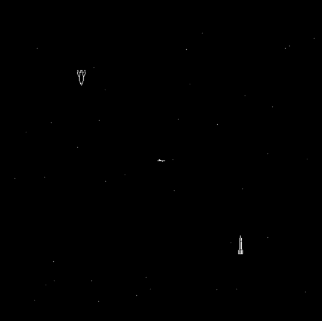

# Spacewasm

Original 1962 game code running on a PDP-1 emulator in Zig + Wasm + JS + HTML5 Canvas

See it live at: https://daneelsan.github.io/spacewasm/



"a", "d", "s", "w" to control the first spaceship, the _"Needle"_.

"j", "l", "k", "i" to control the second spaceship, the _"Wedge"_.

The controls are spin one way, spin the other, thrust, and fire.

Keep away from the central star that pulls the ships with gravity.

The game ends when any of the ships explode into pixel dust.

## Build

To build the .wasm file (and put it in the appropriate place), run:

```shell
$ zig build && cp zig-out/bin/space.wasm docs/space.wasm

$ ls docs/*.wasm
docs/space.wasm
```

```shell
$ zig version
0.14.0-dev.1588+2111f4c38
```

## TODO

[ ] Fix a bug that occurs when a ship crashes with the central star and launches it in an erratic pattern

[ ] Implement a fully featured Type 30 CRT display (phosphor decay, intensity levels, etc.)

[ ] Improve the "game loop" by using `requestAnimationFrame` instead of `setInterval`

[ ] Abstract the IO devices away from the PDP1.zig file

[ ] Abstract the platform away (the only target right now is Wasm + JS)

## Resources

-   https://spacewar.oversigma.com
-   https://www.masswerk.at/spacewar/
-   http://www.bitsavers.org/pdf/dec/pdp1/F15D_PDP1_Handbook_Oct63.pdf
-   http://www.bitsavers.org/pdf/dec/pdp1/F25_PDP1_IO.pdf
-   http://bitsavers.org/pdf/dec/_Books/Bell-ComputerEngineering.pdf
